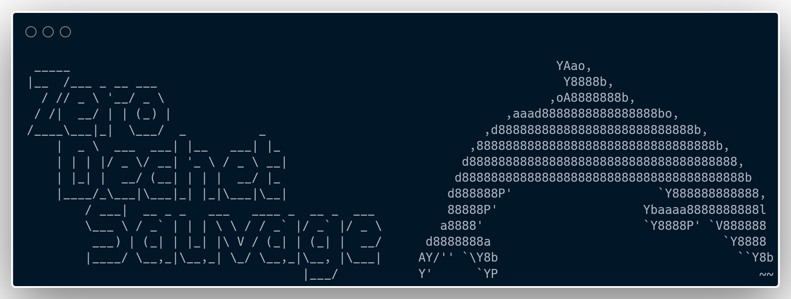

# Zéro Déchet Sauvage
## À propos
[Zéro Déchet Sauvage](http://zds-app.duckdns.org/) (ZDS) est une application de visualisation de données de déchets diffus et collectés au cours d'évènements de collectes. Il s'agit d'une plateforme appartenant à l'association [MerTerre](https://mer-terre.org/) et développée par des bénévoles de l'association Data For Good.

## Démo
Une démo de l'applicaiton a été réalisée lors du Demo Day organisée à la fin de la saison 12 par Data For Good.

## Remerciement
Merci à l'équipe de développement :
* [Floriane](https://github.com/florianeduccini)
* [Hadrien](https://github.com/DridrM)
* [Mehdi](https://github.com/Mendi33)
* [Vincent](https://github.com/Vincentdata)
* [Thibault](https://github.com/tgazagnes)
* [Linh](https://github.com/linh-dinh-1012)
* [Joaquim](https://github.com/JoaquimDiaz)
* [Valérie](https://github.com/ValerieNevo)
* [Kyllian](https://github.com/KyllianBeguin)

## Licence
Ce projet est sous licence MIT. Plus d'information sur le fichier [LICENCE](https://github.com/dataforgoodfr/12_zero_dechet_sauvage/blob/staging/LICENSE).
